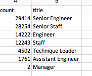
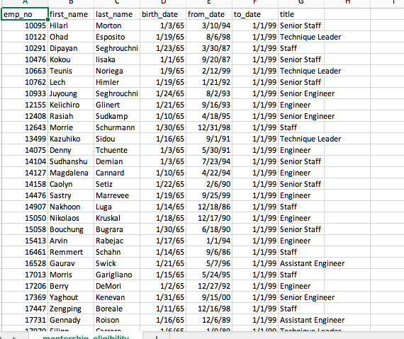

# Pewlett-Hackard-Analysis

## Overview of the Analysis

* The purpose of this assignment was to use SQL code to find out the amount of employees who are due to retire in the Pewlett-Hackard company and who will be coming up next to retire.
* With a company this big, we had to use Postgres with pgAdmin to combine csv's and filter the information we needed. 

## Results

* As a result of our analysis, we were able to get a count of all employees that were ready to retire in the company. We had to filter the data to find employees with birthdays between January 1, 1952 and December 31, 1955.

* With our completed analysis on the company, we were able to figure out how many employees are ready to retire based on Department. The graph below shows the amount who can retire per department.

* We were able to find results for the "silver tsunmai" that is approaching as we filtered the data to figure out which employees will be eligible to retire soon. As you can see in the graph below, we were able to gather a list of employees who are reaching the age of retirement. 

* Our Relsults gave the company a better look at the retirement situation for their company, helping them come up with a plan to fill the positions for each department due to retirement.

## Summary

* As a result of the Silver Tsunami approaching, we found that about 90,398 positions will need to be filled to accomodate the upcoming employees ready to retire.
* With the membership eligibility csv we created, we found that 1550 employees met the criteria to be in the list. This will make it difficult for the members in this list to have to mentor over 90,000 new employees. The company should come up with a plan to help with this problem.

